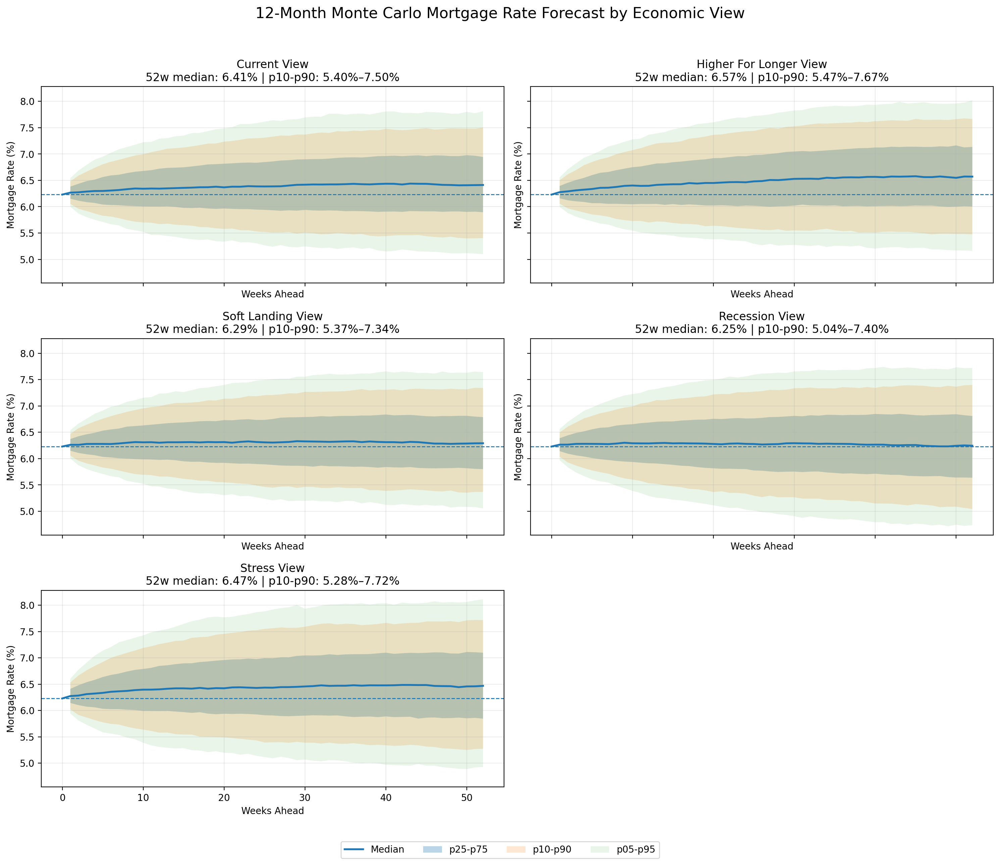

## 12-Month Forecast: Scenario-Based Monte Carlo Simulation

Short-term mortgage rate forecasts can be evaluated with point predictions. However, at a 12-month horizon, uncertainty is dominated by macroeconomic conditions rather than short-term noise.

To address this, the model extends into a **scenario-based Monte Carlo framework**, generating a distribution of possible mortgage rate paths rather than a single forecast.

---

### Approach

The simulation builds on the core decomposition:

> **Mortgage Rate = 10-Year Treasury Yield + Mortgage Spread**

Each simulated path evolves over 52 weeks using:

- Trained Ridge models for Treasury yields and spreads  
- Stochastic shocks calibrated from model residuals  
- Mean reversion:
  - Treasury yields revert toward a long-run equilibrium (~4–4.5%)  
  - Mortgage spreads revert toward their 5-year average  
- Scenario-specific dynamics (drift, volatility, spread behavior)

---

### Economic Scenarios

Five macroeconomic scenarios are modeled:

| Scenario | Description |
|--------|-------------|
| Base Case | Stable growth and inflation |
| Higher-for-Longer | Persistent inflation keeps rates elevated |
| Soft Landing | Gradual disinflation and easing |
| Recession | Rate cuts with temporary spread widening |
| Financial Stress | Credit shock with significant spread expansion |

---

### Economic Views (Scenario Weighting)

Instead of assuming a single macro outlook, the model evaluates multiple **economic views**, each defined by a different set of scenario probabilities:

| View | Key Tilt |
|------|----------|
| Current View | Balanced baseline |
| Higher-for-Longer View | Inflation persistence |
| Soft Landing View | Controlled disinflation |
| Recession View | Downside risk |
| Stress View | Tail risk / credit shock |

---

### Forecast Results by Economic View

The table below summarizes the 52-week forecast distribution under each economic view:

| View | Median (p50) | p10 | p90 |
|------|-------------|------|------|
| Recession View | **6.25%** | 5.04% | 7.40% |
| Soft Landing View | **6.29%** | 5.37% | 7.34% |
| Current View | **6.41%** | 5.40% | 7.50% |
| Stress View | **6.47%** | 5.28% | 7.72% |
| Higher-for-Longer View | **6.57%** | 5.47% | 7.67% |

---

### Key Insights

- **Baseline expectation:** Mortgage rates remain centered in the mid-6% range over the next 12 months  
- **Downside scenarios (recession):** Driven by falling Treasury yields  
- **Upside scenarios (inflation persistence):** Driven by sustained higher rates and elevated spreads  
- **Tail risk (financial stress):** Primarily impacts spreads, creating asymmetric upside risk  

---

### Sensitivity to Macro Assumptions

The difference between views highlights how sensitive long-term forecasts are to macro conditions:

- Median forecast ranges from **~6.25% to ~6.57%**
- Tail outcomes (p90) expand significantly under stress and inflation scenarios  
- Spread dynamics play a key role in widening the distribution under adverse conditions  

---

### Why This Matters

At longer horizons, point forecasts become less meaningful. Instead, decision-making benefits from understanding the **range of plausible outcomes**.

This framework:

- Converts model outputs into probabilistic forecasts  
- Explicitly incorporates macroeconomic uncertainty  
- Captures asymmetric risks (inflation vs recession vs financial stress)  
- Mirrors how institutional macro and rates teams approach forecasting  

---

### Key Takeaway

> Short-term models predict direction.  
> This simulation defines the **distribution of outcomes**.

The shift from point estimates to scenario-weighted distributions is essential for realistic long-term forecasting.